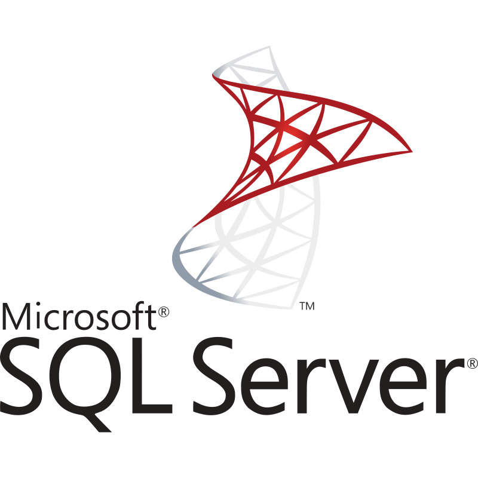

## Hey 👋🏼, I'm Alberto

I've been a software engineer for >22yrs experienced in building, modernizing, and scaling distributed systems, most recently with Fortify on Demand, a cloud-based suite of software security analysis tools. Strong track record leading technical initiatives and delivering reliable, maintainable solutions across diverse platforms. Experienced in integrating emerging AI tech into personal and team workflows. Skilled at communicating complex technical concepts to non‑technical stakeholders to support decision-making and collaboration.

### Languages

### Frameworks

### Data Tech
&nbsp;&nbsp;

### Infrastructure

### CI/CD

### Monitoring & Observability

### Hobby Tech Skills

